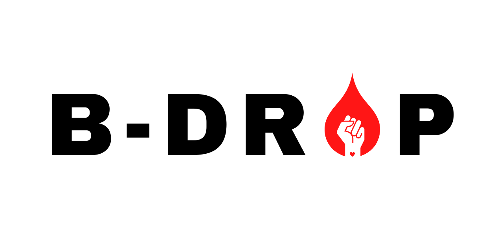
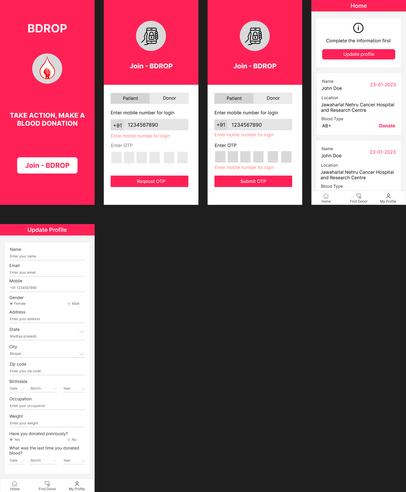
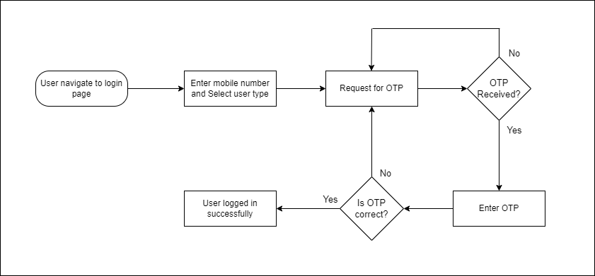
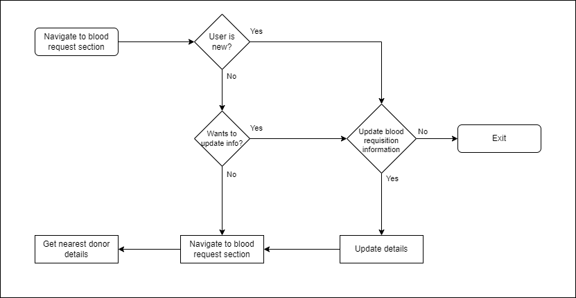

  

# B-Drop (Improving the digital experience of blood donation)

### Project summary

This project is a website to match potential blood donors with those in need of blood donations. Our project would provide a way for those in need of donations to post a request for blood, including the type of blood needed, quantity needed, and location. Potential donors could search for requests by their location, type of blood needed, or other criteria. This would also provide a way for donors to register and provide information about their blood type and other pertinent information. It could also provide education about blood donation and safety to encourage more people to become donors.

This web application is designed to facilitate the connection between blood donors and patients who need a blood transfusion. With this application, donors have the opportunity to donate their blood to those in need and patients can find the type and amount of blood they need quickly.

For donors, the application allows them to create an account and provide information about their blood type and contact information. They can also indicate their availability to donate blood and when they are available. Donors can also view a list of patients and choose which ones they would like to donate to.

For patients, the application allows them to create an account and provide information about their blood type and contact information. They can also provide information about their medical history and the type and amount of blood they need. Patients can then search for donors in their area who can meet their needs.

The application also features a messaging system where donors and patients can communicate with each other. This messaging system is secure and allows them to exchange information about the donation process.

The application also has an administrative portal where administrators can manage the accounts of donors and patients. Administrators can also view reports on donations and usage of the application.

> “Take Action, Make a Blood Donation”

## Mockups

  

## Userflows

  

  

