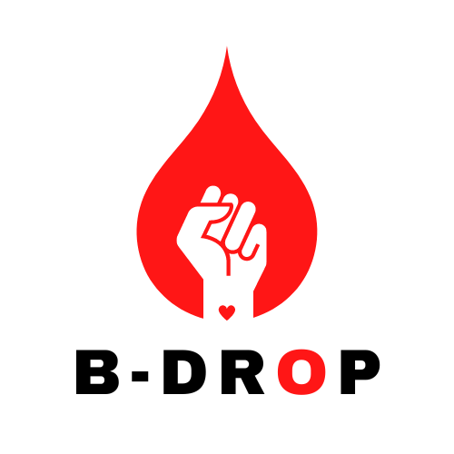

  

# B-Drop (Improving the digital experience of blood donation)

### Project summary

This project is a website to match potential blood donors with those in need of blood donations. Our project would provide a way for those in need of donations to post a request for blood, including the type of blood needed, quantity needed, and location. Potential donors could search for requests by their location, type of blood needed, or other criteria. This would also provide a way for donors to register and provide information about their blood type and other pertinent information. It could also provide education about blood donation and safety to encourage more people to become donors.

> “Take Action, Make a Blood Donation”

  

